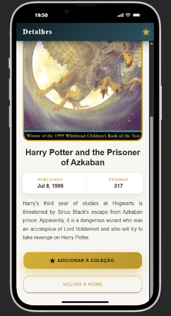
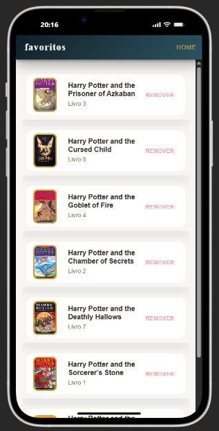

# Ionic Vercel App

##  Descrição do Projeto
Este projeto é uma aplicação mobile desenvolvida com Ionic e Angular.
O objetivo da aplicação é consumir uma API de livros, exibir um livro aleatório,
permitir a visualização de seus detalhes e possibilitar que o usuário salve
livros favoritos para consulta posterior.

A aplicação possui três telas principais: 
- **Home**: exibe um livro aleatório
- **Detalhes**: mostra informações completas do livro
- **Favoritos**: lista os livros salvos pelo usuário

---

##  Tecnologias Utilizadas
- **Ionic Framework 7**
- **Angular 15**
- **Node.js 20**
- **TypeScript**
- **HTML / SCSS**
- **Vercel** (Deploy)

---

##  Execução do Projeto em Ambiente Local

### 🔹 Pré-requisitos
Certifique-se de ter instalado em sua máquina:
- **Node.js** (versão 20 ou superior)
- **NPM**
- **Ionic CLI**

Para instalar o Ionic CLI:
```bash
npm install -g @ionic/cli
```
## Telas da Aplicação

### Home


### Detalhes


### Favoritos

